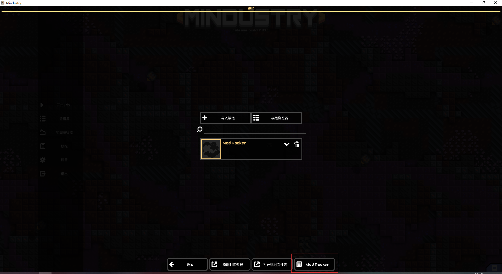

>这是一个用于mindustry的工具项目

ModPacker是一个用于mindustry的mod打包工具，工具本身目前仅制作了`inGame`模式，即目前的工具本身就是一个mod。

这个工具的作用即将数个mod和你需要的附加文件打包进一个单独的mod，以便分发你想要的组合（其实这一般被叫做整合包）。打包得到的文件也是一个mod，那是一个安装器，在用户安装这个安装器后启动游戏，会弹出mod安装引导界面引导用户进行安装。安装器是独立的mod，不需要任何额外的依赖项。

---

当前的mod版本工具会在你的mindustry游戏mod设置界面添加一个`ModPacker`按钮用于打开工具的页面，如下：

---
###### 尽管现阶段该工具仅有`inGame`模式，但在后续的迭代中会完善命令行模式。如果我有时间的话会制作该工具的图形化应用程序。